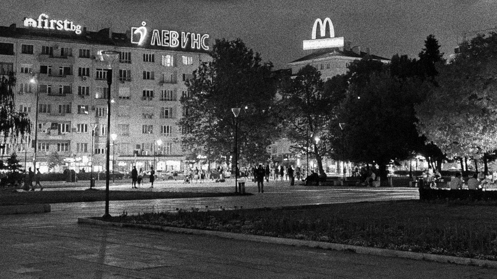
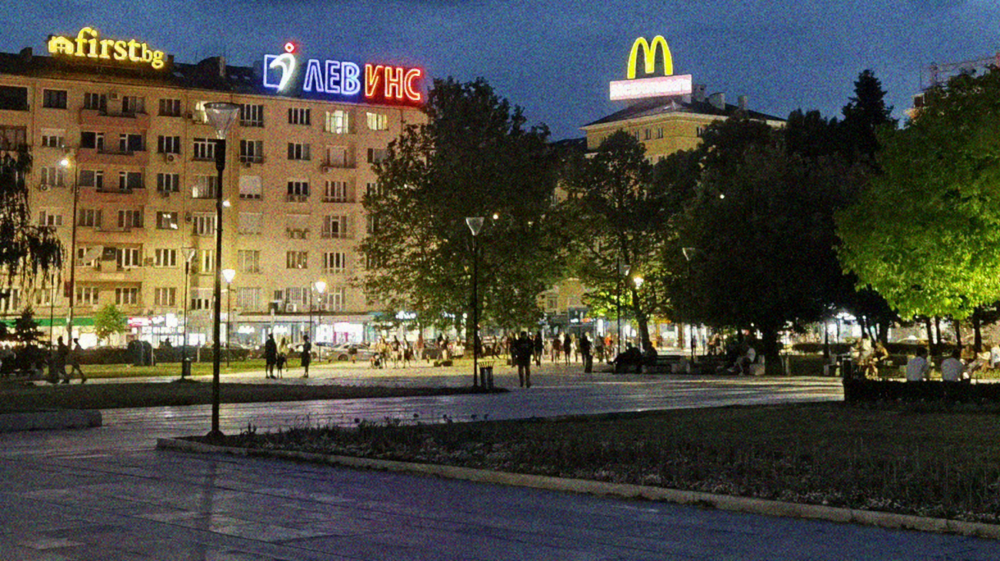
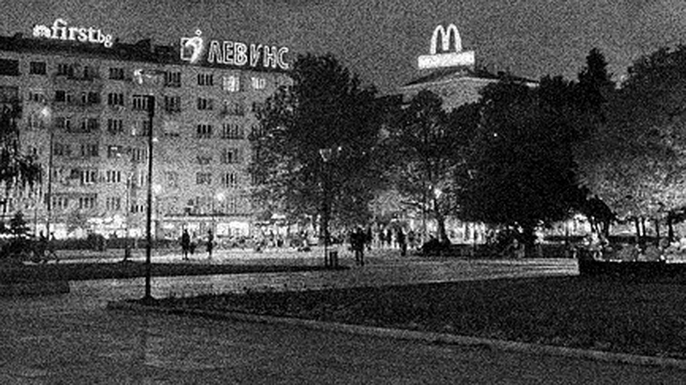

Filmgrainer is an image processing algorithm that adds noise to an image resembling photographic film grain. It's implemented in Python and runs as a command line utility on Linux platforms, installable with pip.

For further description and more examples see this [blog post](https://larsee.com/blog/2022/11/introducing-filmgrainer/).

## Installation

Filmgrainer can be installed directly from this repository with pip:

```text
pip install git+https://github.com/larspontoppidan/filmgrainer
```

The installation pulls in numpy and pillow. Consider installing in a virtual environment.

## Examples

#### Input image:  


#### Transformed to a black and white photograph:
`filmgrainer --gray --type 3 --power 0.8,0.2,0.1 -o bw_neg.png input.jpg`



#### or a grainy color negative:
`filmgrainer --type 4 --sat 0.8 --power 1,0.2,0.2 -o color_neg.png input.jpg`



#### With just a gentle amount of dias-film like grain:
`filmgrainer --type 1 --sat 0.6 --power 0.75,0.1,0.1 -o dias.png input.jpg`


#### Totally trashed by grain using the scale feature and sharpen:
`filmgrainer --type 1 --gray --power 1,0.3,0.2 --scale 3 --sharpen 1 -o trashed_bw.png input.jpg`



`filmgrainer --type 1 --sat 0.8 --power 1,0.3,0.2 --scale 3 --sharpen 1 -o trashed.png input.jpg`


